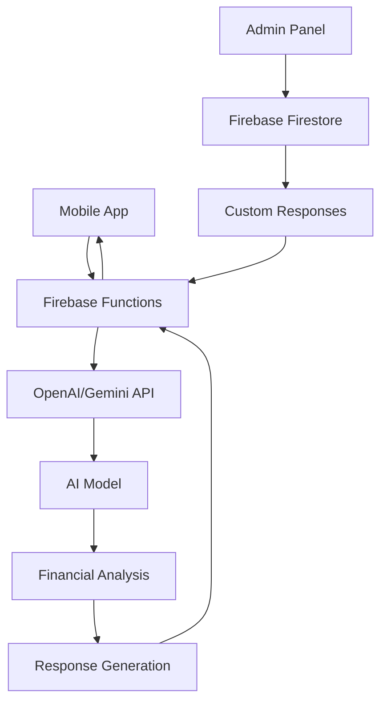

# AI Chatbot Functionality Design

## Overview
This document outlines the design for the AI chatbot integration in Xpenso, providing users with financial insights, budgeting tips, and expense predictions.

## Feature Requirements
- Natural language queries about expenses
- Personalized financial tips
- Budget overshoot predictions
- Monthly savings recommendations
- Upcoming recurring expense predictions
- Integration with Firebase Functions and OpenAI/Gemini API
- Admin panel for response configuration

## Implementation Strategy

### AI Service Providers
1. **OpenAI API** - For GPT-based chatbot
2. **Google Gemini API** - For Gemini-based chatbot
3. **Firebase Functions** - For server-side AI integration

### Chatbot Architecture


## Data Model for Chatbot

### Chat Message Model
```dart
class ChatMessage {
  final String id;
  final String userId;
  final String content;
  final bool isUserMessage;
  final DateTime timestamp;
  final ChatMessageType type;
  final Map<String, dynamic>? metadata;
}

enum ChatMessageType {
  text,
  budgetTip,
  expensePrediction,
  savingsRecommendation,
  categoryInsight
}
```

### AI Configuration Model (Admin Panel)
```dart
class AIConfiguration {
  final String id;
  final String promptTemplate;
  final String responseFormat;
  final bool isEnabled;
  final List<String> blockedKeywords;
  final DateTime updatedAt;
}
```

## UI Implementation

### Chat Interface
- Chat screen with message history
- Text input field for queries
- Send button
- Suggested prompts for common queries
- Typing indicators for AI responses

### Message Display
- Different styling for user vs AI messages
- Support for rich responses (tips, predictions)
- Actionable recommendations with links
- Timestamps for messages
- Message grouping by date

### Suggested Prompts
- "How much did I spend on food this month?"
- "Am I on track with my budget?"
- "Where can I save money?"
- "What are my upcoming expenses?"
- "Show me my spending trends"

## Service Layer Design

### AIChatService
The AIChatService will handle chatbot interactions:

```dart
class AIChatService {
  static final AIChatService _instance = AIChatService._();
  static AIChatService get instance => _instance;
  
  AIChatService._();
  
  final FirebaseFirestore _firestore = FirebaseFirestore.instance;
  final FirebaseFunctions _functions = FirebaseFunctions.instance;
  
  // Send user message to AI
  Future<ChatMessage> sendUserMessage(String userId, String message) async {
    // Save user message to Firestore
    // Call Firebase Function for AI processing
    // Save AI response to Firestore
    // Return AI response message
  }
  
  // Get chat history
  Stream<List<ChatMessage>> getChatHistory(String userId) async* {
    // Query chat messages for user
    // Order by timestamp
  }
  
  // Generate budget tip
  Future<ChatMessage> generateBudgetTip(String userId) async {
    // Call AI with budget analysis prompt
    // Format response as budget tip
  }
  
  // Predict upcoming expenses
  Future<ChatMessage> predictUpcomingExpenses(String userId) async {
    // Analyze recurring expenses
    // Call AI with prediction prompt
    // Format response as expense prediction
  }
  
  // Generate savings recommendation
  Future<ChatMessage> generateSavingsRecommendation(String userId) async {
    // Analyze spending patterns
    // Call AI with savings prompt
    // Format response as recommendation
  }
}
```

## Firebase Functions Implementation

### Server-side AI Integration
```javascript
// Function to process chat messages
exports.processAIChatMessage = functions.https.onCall(async (data, context) => {
  // Validate user authentication
  // Retrieve user expense data
  // Format prompt for AI model
  // Call OpenAI/Gemini API
  // Process and format response
  // Save to Firestore
  // Return formatted response
});

// Function to generate budget tips
exports.generateBudgetTips = functions.https.onCall(async (data, context) => {
  // Validate user authentication
  // Retrieve user budget data
  // Format prompt for AI model
  // Call OpenAI/Gemini API
  // Process and format response
  // Return budget tips
});
```

## AI Prompt Engineering

### Prompt Templates
1. **Expense Query Template**:
   ```
   User: {user_query}
   User's recent expenses: {expense_data}
   User's budgets: {budget_data}
   User's spending patterns: {pattern_data}
   
   Please answer the user's query based on their financial data.
   ```

2. **Budget Tip Template**:
   ```
   User's current budgets: {budget_data}
   User's recent spending: {expense_data}
   
   Provide personalized budgeting tips to help the user manage their finances better.
   Focus on areas where they're overspending or could improve.
   ```

3. **Prediction Template**:
   ```
   User's recurring expenses: {recurring_data}
   User's spending history: {history_data}
   
   Predict upcoming expenses for the next week/month based on patterns.
   Include any recurring expenses that are due soon.
   ```

## Admin Panel Integration

### Custom Response Management
- Predefined response templates
- Custom prompt editing
- Response validation
- A/B testing of different prompts

### Training Data Management
- Common user queries
- Effective response examples
- Feedback collection
- Model fine-tuning options

## User Experience

### Onboarding
- Introduction to chatbot capabilities
- Example queries to try
- Privacy explanation for data usage
- Opt-in for AI features

### Interaction Flow
1. User opens chat interface
2. Sees suggested prompts or enters custom query
3. AI processes query with user's financial data
4. AI returns personalized response
5. User can continue conversation or act on recommendations

### Response Types
- Direct answers to queries
- Financial insights based on spending patterns
- Budgeting recommendations
- Expense predictions
- Savings suggestions

## Privacy and Security

### Data Protection
- Only user's own financial data sent to AI
- No personally identifiable information in prompts
- Secure transmission of data to Firebase Functions
- Proper Firestore security rules

### User Consent
- Clear explanation of data usage
- Opt-in requirement for AI features
- Ability to delete chat history
- Transparency about AI processing

## Error Handling

### AI Integration Errors
- API connectivity issues
- Rate limiting
- Invalid responses
- Prompt formatting errors

### User Feedback
- Clear error messages for API failures
- Fallback to generic responses
- Retry options for failed requests
- Feedback collection for improvement

## Testing Strategy

### Unit Tests
- Test prompt formatting logic
- Validate response processing
- Test Firestore operations
- Verify data model operations

### Integration Tests
- Test complete chat flow
- Verify AI response quality
- Test admin configuration integration
- Validate error handling

### Performance Tests
- Test response time from AI
- Verify prompt efficiency
- Check memory usage during processing

## Implementation Considerations

### Cost Management
- Efficient prompt design to minimize tokens
- Caching of common responses
- Rate limiting to prevent abuse
- Monitoring of API usage costs

### Data Consistency
- Maintain chat history in Firestore
- Handle user data changes affecting AI responses
- Prevent duplicate processing
- Manage timezone differences in data analysis

### Pro Feature Limitations
- Only available to Pro subscribers
- Clear upgrade prompts for free users
- Limited queries per day for free users (if any)
- Full features only for Pro users

## Future Enhancements
- Voice input for chat queries
- Multilingual support
- Integration with smart assistants
- Advanced financial planning features
- Custom AI model training with user data