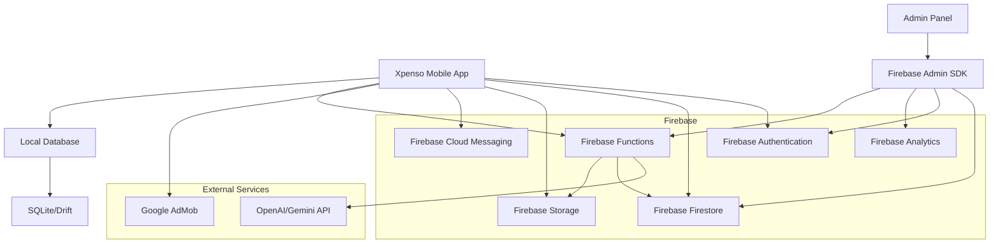

# Xpenso - Expense Tracker & Budgeting App Architecture

## Overview
Xpenso is a comprehensive expense tracking and budgeting application with both free and pro versions. The app uses Firebase as its backend and includes features like expense tracking, budgeting, analytics, and an AI-powered chatbot. It also has an admin panel for monitoring and management.

## Architecture Diagram



## Components

### 1. Mobile App (Flutter)
The main mobile application built with Flutter that runs on Android devices.

#### Core Features
- **Expense Tracking**
  - Add/edit/delete expenses
  - Support for multiple currencies
  - Notes, tags, and payment methods per transaction
  - Receipt attachment (image upload)
  - Offline-first with Firestore sync
  
- **Budgeting & Analytics**
  - Monthly budget creation
  - Real-time budget progress tracking
  - Reports with charts
  - Daily/weekly/monthly expense summaries
  
- **Pro Features**
  - Recurring expenses
  - Custom categories with icons
  - Expense reminders & push notifications
  - Multi-user accounts
  - AI-powered spending insights
  - Cloud backup & restore
  
- **UI/UX Features**
  - Clean, grid/card-based layout
  - Theme options (Red-White, Blue-White, Dark Mode)
  - Quick Add Widget
  - Voice input for expenses
  - Passcode/Face Unlock for security

### 2. Firebase Backend
Firebase provides the backend infrastructure for the app.

#### Firebase Authentication
- Email/password authentication
- Google Sign-In
- Phone authentication

#### Firebase Firestore
- User profiles
- Expense records
- Budget data
- Categories
- Subscription information
- Shared account data

#### Firebase Storage
- Receipt images
- Exported reports (CSV/PDF)
- Backup files

#### Firebase Cloud Messaging
- Expense reminders
- Push notifications for shared accounts
- Admin alerts

#### Firebase Functions
- CSV/PDF export functionality
- AI chatbot API integration
- Admin analytics aggregation
- Data synchronization logic

### 3. Admin Panel
A web-based admin panel for managing the app and its users.

#### Features
- User management (view, block, suspend)
- Subscription tracking
- Expense data monitoring
- Analytics and trends
- AdMob monetization reports
- Feedback and crash report management
- AI chatbot response configuration
- Fraud/risk alert monitoring

### 4. AI Chatbot
An AI-powered assistant integrated into the app for financial insights.

#### Features
- Answering user queries about expenses
- Personalized financial tips
- Predicting upcoming recurring expenses
- Integration with Firebase Functions and OpenAI/Gemini API

## Data Models

### User Model
```dart
class User {
  final String uid;
  final String email;
  final String name;
  final String photoUrl;
  final bool isPro;
  final DateTime subscriptionExpiry;
  final DateTime createdAt;
  final bool isActive;
}
```

### Expense Model
```dart
class Expense {
  final String id;
  final String userId;
  final String title;
  final double amount;
  final String currency;
  final String category;
  final String paymentMethod;
  final String notes;
  final List<String> tags;
  final DateTime date;
  final String receiptUrl;
  final bool isRecurring;
  final String recurringType; // daily, weekly, monthly, yearly
}
```

### Budget Model
```dart
class Budget {
  final String id;
  final String userId;
  final String category;
  final double amount;
  final double spent;
  final DateTime startDate;
  final DateTime endDate;
  final bool isRecurring;
}
```

### Category Model
```dart
class Category {
  final String id;
  final String name;
  final String icon;
  final bool isCustom;
  final String userId; // for custom categories
}
```

## Folder Structure
```
lib/
├── models/
│   ├── user.dart
│   ├── expense.dart
│   ├── budget.dart
│   └── category.dart
├── services/
│   ├── firebase_service.dart
│   ├── auth_service.dart
│   ├── expense_service.dart
│   ├── budget_service.dart
│   └── notification_service.dart
├── screens/
│   ├── home_screen.dart
│   ├── expense_list_screen.dart
│   ├── add_expense_screen.dart
│   ├── budget_screen.dart
│   ├── reports_screen.dart
│   ├── settings_screen.dart
│   └── ai_chat_screen.dart
├── widgets/
│   ├── expense_card.dart
│   ├── budget_progress.dart
│   ├── quick_add_widget.dart
│   └── charts/
│       ├── bar_chart.dart
│       ├── pie_chart.dart
│       └── line_chart.dart
├── utils/
│   ├── currency_utils.dart
│   ├── date_utils.dart
│   └── constants.dart
└── main.dart
```

## Development Phases

### Phase 1 (Day 1-2): Core Features
- Expense add/edit/delete functionality
- Default categories implementation
- Budget creation and progress bar
- Firebase Authentication setup
- Firestore integration
- AdMob integration

### Phase 2 (Week 1): Reports and Admin Panel
- Reports and charts implementation
- CSV export functionality
- Basic Admin Panel (user management, expense monitoring)

### Phase 3 (Week 2): Pro Features and AI Integration
- Pro features (recurring expenses, custom categories, reminders)
- Multi-user accounts
- AI chatbot integration
- Cloud backup and restore functionality

## Monetization Strategy
- Free version with AdMob (banner and interstitial ads)
- Pro version with subscription model (monthly/annual)
- Firebase Billing integration for subscription management

## Firebase Configuration
To properly configure Firebase for Xpenso, you'll need to replace the placeholder values in `lib/firebase_options.dart` with your actual Firebase project credentials:

```dart
static const FirebaseOptions android = FirebaseOptions(
  apiKey: "AIzaSyB1234567890abcdefghijklmnopqrstuvwxyz",
  appId: "1:1234567890:android:abcdefghijklmnopqrstuvwxyz123456",
  messagingSenderId: "1234567890",
  projectId: "xpenso-expense-tracker",
  storageBucket: "xpenso-expense-tracker.appspot.com",
);
```

## Security Considerations
- Local authentication with passcode or biometrics
- Secure storage of sensitive data
- Firebase security rules for data protection