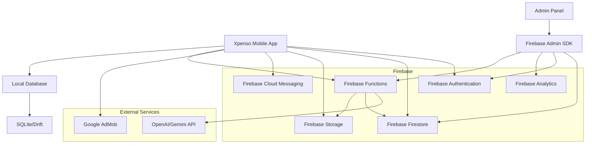

# Xpenso - Comprehensive Documentation

## Table of Contents
1. [Overview](#overview)
2. [Architecture](#architecture)
3. [Data Models](#data-models)
4. [Features](#features)
   - [Expense Tracking](#expense-tracking)
   - [Budgeting](#budgeting)
   - [Reports and Analytics](#reports-and-analytics)
   - [Pro Features](#pro-features)
5. [UI/UX Design](#uiux-design)
6. [Firebase Integration](#firebase-integration)
7. [Admin Panel](#admin-panel)
8. [AI Chatbot](#ai-chatbot)
9. [Monetization](#monetization)
10. [Security](#security)
11. [Testing](#testing)
12. [Deployment](#deployment)

## Overview
Xpenso is a comprehensive expense tracking and budgeting application built with Flutter and Firebase. It helps users manage their personal finances with features like expense tracking, budgeting, analytics, and AI-powered financial insights. The app offers both free and Pro versions with different feature sets.

## Architecture
The Xpenso app follows a client-server architecture with Flutter as the frontend and Firebase as the backend. The app is designed to be offline-first with automatic synchronization to Firestore when connectivity is available.

### Components
- **Mobile App**: Flutter application for Android with offline capabilities
- **Firebase Backend**: Authentication, Firestore, Storage, Cloud Messaging, Functions
- **Admin Panel**: Web-based management interface for app administrators
- **AI Chatbot**: Integration with OpenAI/Gemini API for financial insights

### Architecture Diagram


## Data Models

### User Model
```dart
class XpensoUser {
  final String uid;
  final String email;
  final String name;
  final String photoUrl;
  final bool isPro;
  final DateTime subscriptionExpiry;
  final DateTime createdAt;
  final bool isActive;
  final DateTime lastLoginAt;
}
```

### Expense Model
```dart
class Expense {
  final String id;
  final String userId;
  final String title;
  final double amount;
  final String currency;
  final String category;
  final String paymentMethod;
  final String notes;
  final List<String> tags;
  final DateTime date;
  final String receiptUrl;
  final bool isRecurring;
  final String recurringTemplateId;
  final String recurringType;
  final int recurringInterval;
  final String sharedAccountId;
  final String paidByUserId;
  final List<String> splitWithUserIds;
}
```

### Budget Model
```dart
class Budget {
  final String id;
  final String userId;
  final String category;
  final double amount;
  final double spent;
  final DateTime startDate;
  final DateTime endDate;
  final bool isRecurring;
  final String sharedAccountId;
}
```

### Category Model
```dart
class Category {
  final String id;
  final String name;
  final String icon;
  final bool isCustom;
  final String userId;
  final DateTime createdAt;
  final String color;
}
```

## Features

### Expense Tracking
Users can track their expenses with detailed information:
- Add, edit, and delete expenses
- Multiple currencies support
- Notes, tags, and payment methods
- Receipt attachment with Firebase Storage
- Offline-first with Firestore sync

### Budgeting
Users can create and manage budgets:
- Monthly budget creation (per category or overall)
- Real-time budget progress tracking
- Recurring budgets for regular expenses
- Budget notifications when approaching limits

### Reports and Analytics
The app provides comprehensive financial insights:
- Bar, pie, and line charts using fl_chart
- Daily/weekly/monthly expense summaries
- Spending trends analysis
- Category distribution visualization
- Export data to CSV and PDF

### Pro Features
Xpenso Pro offers advanced functionality:
- Recurring expenses with automatic processing
- Custom categories with icons
- Expense reminders and push notifications
- Multi-user accounts for shared/family expenses
- AI-powered spending insights
- Cloud backup and restore

## UI/UX Design

### Layout
- Clean, grid/card-based layout
- Responsive design for different screen sizes
- Intuitive navigation with bottom navigation bar
- Quick action buttons for common operations

### Themes
- Red-White theme
- Blue-White theme
- Dark Mode theme
- Theme switching in settings

### Widgets
- Quick Add Widget for home screen
- Budget progress indicators
- Expense cards with detailed information
- Category selection interfaces

### Accessibility
- Voice input for expenses
- Large touch targets
- Clear visual hierarchy
- Color-blind friendly palette

## Firebase Integration

### Authentication
- Email/password authentication
- Google Sign-In
- Phone authentication
- User session management

### Firestore Structure
```
/users/{userId}
/expenses/{expenseId}
/budgets/{budgetId}
/categories/{categoryId}
/subscriptions/{subscriptionId}
/shared_accounts/{accountId}
/reminders/{reminderId}
/backups/{backupId}
```

### Cloud Storage
- Receipt images storage
- Backup files storage
- Exported reports storage
- User-specific file organization

### Cloud Functions
- CSV/PDF export processing
- AI chatbot API integration
- Admin analytics aggregation
- Recurring expense processing
- Notification scheduling

### Cloud Messaging
- Expense reminders
- Push notifications for shared accounts
- Admin alerts
- Periodic summaries

## Admin Panel
The admin panel provides management capabilities:
- User management (view, block, suspend)
- Subscription tracking
- Expense data monitoring
- Analytics and trends visualization
- AdMob monetization reports
- Feedback and crash report management
- AI chatbot response configuration
- Fraud/risk alert monitoring

## AI Chatbot
The AI chatbot offers financial insights:
- Natural language queries about expenses
- Personalized financial tips
- Budget overshoot predictions
- Monthly savings recommendations
- Upcoming recurring expense predictions
- Integration with Firebase Functions and OpenAI/Gemini API

## Monetization

### Free Version
- AdMob banner and interstitial ads
- Limited features
- Basic expense tracking and budgeting

### Pro Version
- Subscription model (monthly/annual)
- Firebase Billing integration
- All advanced features unlocked
- Ad-free experience

## Security

### App Security
- Passcode protection
- Face Unlock authentication
- Secure local data storage
- Data encryption at rest

### Firebase Security
- Firestore security rules
- Authentication-based access control
- Data validation and sanitization
- Audit logging for admin actions

### Data Privacy
- GDPR/CCPA compliance
- User data isolation
- Secure data transmission
- Right to deletion implementation

## Testing

### Unit Testing
- Model validation tests
- Service layer tests
- Utility function tests
- Data processing tests

### Integration Testing
- Firebase integration tests
- UI component tests
- Feature workflow tests
- Data synchronization tests

### Performance Testing
- Offline operation performance
- Chart rendering efficiency
- Data export processing
- Notification delivery timing

### Security Testing
- Authentication flow validation
- Data access control verification
- Input validation testing
- Penetration testing

## Deployment

### Mobile App
- Android APK generation
- Google Play Store deployment
- Version management
- Release notes documentation

### Admin Panel
- Web deployment to Firebase Hosting
- Admin user access control
- Monitoring dashboard
- Support documentation

### Firebase Configuration
- Project setup and configuration
- Security rules deployment
- Cloud Functions deployment
- Storage bucket configuration

### CI/CD Pipeline
- Automated testing
- Build automation
- Deployment scripts
- Version control integration

## Future Enhancements
- iOS app development
- Desktop app versions
- Advanced financial planning tools
- Integration with banking APIs
- Smart expense categorization
- Financial goal tracking
- Investment tracking features

## Support and Maintenance
- User feedback collection
- Bug reporting system
- Regular security updates
- Feature enhancement roadmap